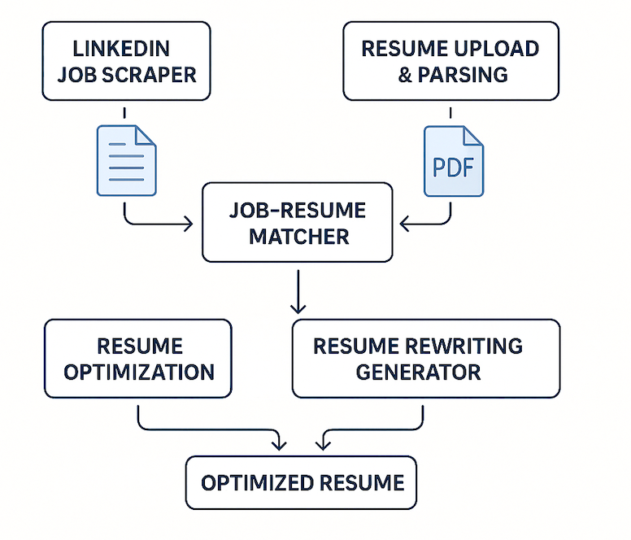

# 🔍 LinkedIn Auto-Resume Submission System

An intelligent data science application that automates job searching and application preparation on LinkedIn. This project streamlines the job application process by scraping job listings, parsing resumes, evaluating match scores, and generating personalized cover letters using GPT.

---

## 🎯 Project Objective

Build an end-to-end automated LinkedIn job application system that:

- Scrapes LinkedIn job postings by keyword and location.
- Parses and analyzes user-uploaded resumes.
- Matches resumes with job descriptions using NLP techniques.
- Uses GPT to generate tailored cover letters.
- Allows exporting or preparing applications for manual or one-click submission.

---

## 🧠 Key Features

### 🔹 LinkedIn Job Scraper
- Simulated login & search using job title, keyword, and location.
- Extracts job title, company name, location, job description, and post date.

### 🔹 Resume Parser (coming soon)
- Accepts user-uploaded resume (PDF).
- Extracts structured text including education, skills, and work experience.

### 🔹 Job–Resume Matcher
- Computes semantic similarity using **TF-IDF** or **Sentence-BERT**.
- Generates match score between resume and job description.

### 🔹 Cover Letter Generator
- Uses OpenAI GPT API to write tailored cover letters.
- Input: Job description + extracted resume summary.

### 🔹 Application Manager
- Local job database using SQLite.
- Allows marking jobs as saved or applied.
- Supports one-click export and tracking.

### 🔹 Frontend (Streamlit UI)
- Upload resume, set job preferences (keywords, location).
- View job list, match score, and generate letters.

---

## 🖼️ System Architecture



---

## ⚙️ Technical Stack

- **Python** for core logic & data processing
- **BeautifulSoup / Selenium** for job scraping
- **PDFMiner / PyMuPDF** for resume text extraction
- **Scikit-learn / Sentence-BERT** for similarity scoring
- **OpenAI GPT API** for cover letter generation
- **Streamlit** for UI
- **SQLite** for local job/applicant data management

---

## 🚧 Out of Scope (MVP)

- Multi-resume or multi-template support
- Auto-clicking LinkedIn's "Apply" buttons
- Multilingual job/resume support

---

## 📁 Folder Structure

```plaintext
linkedin-auto-resume/
├── scraper/          # Job scraping logic
├── parser/           # Resume text extractor
├── matcher/          # NLP-based job-resume matcher
├── generator/        # GPT cover letter generator
├── ui/               # Streamlit frontend
├── data/             # Sample jobs/resumes
├── database/         # SQLite storage
├── .env.template     # API keys and credentials (safe template)
└── README.md         # Project documentation

```
---

## 🚀 Getting Started

1. Clone the repository
2. Set up virtual environment
3. Add your `.env` file with OpenAI credentials
4. Run the Streamlit interface:
   ```bash
   streamlit run ui/app.py
